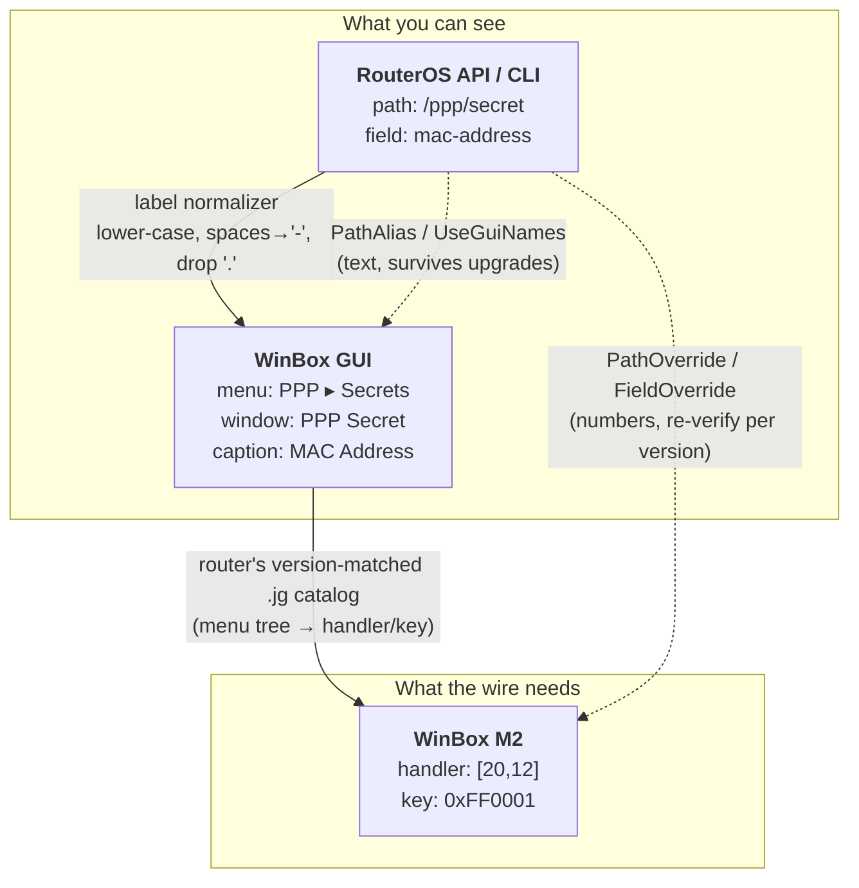

# tik4net architecture (4.0)

A map of the codebase for contributors. For *usage* documentation see the [wiki](https://github.com/danikf/tik4net/wiki); for agent-facing working rules see [AGENTS.md](AGENTS.md).

## Layer cake

```
tik4net.objects  — O/R mapper: [TikEntity]/[TikProperty] → metadata cache → CRUD extensions,
                   change tracking, list merge
        │
ITikConnection / ITikCommand  — transport-neutral contract + capability model
        │
   ┌────┴───────────────────────────────────────────────────────────────┐
   │ ApiConnection             — binary sentence protocol (the reference)│
   │ TikCommandConnectionBase  — shared base for all command transports  │
   │   ├─ CliConnectionBase    — Telnet, MAC-Telnet, WinBox CLI ×2, SSH  │
   │   ├─ RestConnection       — RouterOS 7.1+ REST/JSON                 │
   │   └─ WinboxNativeConnection — structured M2 (+ MAC variant)         │
   └─────────────────────────────────────────────────────────────────────┘
   Support: Mndp (discovery), Crypto (EC-SRP5, WinBox stream cipher),
            TikPath, TikQueryStack, PollingMonitorEngine, capability flags
```

## Packages

| Package | Project | TFM | Notes |
|---|---|---|---|
| `tik4net` | `tik4net/` + `tik4net.objects/`, packed by `tik4net.package/` | `netstandard2.0;net8.0` | Core **and** O/R mapper — two assemblies, one package. Runtime dep on the `netstandard2.0` leg only: `System.Text.Json` (net8.0 has it in the shared framework, so that leg has no dependencies at all) |
| `tik4net.ssh` | `tik4net.ssh/` | `netstandard2.0;net8.0` | Satellite — isolates the `Renci.SshNet` dependency |
| `tik4net.testing` | `tik4net.testing/` | `netstandard2.0;net8.0` | `TikFakeConnection` for router-free consumer tests |
| `tik4net.mcp` | `Tools/tik4net.mcp/` | .NET tool | Dev/debug MCP helper, not a user-facing library |

`tik4net/` and `tik4net.objects/` are both `IsPackable=false` — they build assemblies, but the
`tik4net` package itself is produced by `tik4net.package/`, a project that compiles nothing and
only collects the two DLLs (plus their XML docs) into `lib/<tfm>/` for each target framework. It
exists because `tik4net.objects` references `tik4net`, so `tik4net` cannot reference it back to pack it.

`netstandard2.0` is not being phased out — Unity/Xamarin/.NET Framework reach is a stated goal (see the
README) — so multi-targeting only *adds* the `net8.0` leg. The `net8.0` build is also where the
`net8.0`-only async streaming API lives (`ITikStreamingCommand`, `IAsyncEnumerable<ITikReSentence>`) — see
the `tik4net` core section below.

Consequently `tik4net.ssh` and `tik4net.testing` reference their compile-time projects with
`PrivateAssets="all"` and additionally reference `tik4net.package`, which is what puts the real
`tik4net` dependency into their `.nuspec`. Without that split they would declare a dependency on
a package ID that does not exist on nuget.org.

Non-shipping: `samples/tik4net.samples` (the demo app — `console`/`torch`/`crud` subcommands, net8.0),
`tik4net.examples` (compile-check for the wiki snippets, net48) and `tik4net.benchmarks` (BenchmarkDotNet,
net8.0). All SDK-style.

## Layer 1 — `tik4net` core

### The contract

`ITikConnection` (`tik4net/ITikConnection.cs`) covers lifecycle (`Open`/`OpenAsync` ×4, `Close`,
`Dispose`), configuration (`Encoding`, timeouts), diagnostic events, and command factories — what
every transport has. Three things that not every transport can reasonably provide live on their own
interfaces, each paired with the capability flag that answers the same question:

- `ITikRawSentenceConnection` (`tik4net/ITikRawSentenceConnection.cs`) — `CallCommandSync`, both
  overloads (`RawCommand`). The contract is a command **in the connection's own language**, sent
  unchanged: API sentence words on the binary API, RouterOS CLI text on the five CLI transports. It is the
  low-level half of what `CreateRawCommand` offers at the `ITikCommand` level — one flag gates both, since
  a transport either has a writable command language or has neither level. `Api`/`ApiSsl` and the CLI family
  do; REST and WinBox native have a request shape rather than a language, so `TikCommandConnectionBase`
  deliberately does not implement the interface and `CliConnectionBase` does. Both levels raise a trap when
  the router reports an error, rather than handing the error text back as a value.
  (`RawSentences` is an `[Obsolete]` alias of `RawCommand`, the same bit — the two were always set together.)
- `ITikSafeModeConnection` (`tik4net/ITikSafeModeConnection.cs`) — `SafeModeTake`/`Release`/`Unroll`/`Get`
  (`SafeMode`). ApiConnection, `CliConnectionBase` (so all five CLI transports incl. SSH) and
  WinboxNativeConnection implement it; RestConnection does not.
- `ITikTaggedConnection` (`tik4net/ITikTaggedConnection.cs`) — `SendTagWithSyncCommand` (`Tagging`).
  Binary API only; the other transports have no meaningful implementation of it.

`CallCommandAsync` (both overloads, each taking a `CancellationToken`) sits beside `CallCommandSync` on
`ITikRawSentenceConnection`. The low level was synchronous-only, which was backwards — it is where the long
commands live (`/export`, a script) while the levels above it had been awaitable for some time. On the CLI
family the async form is the implementation and the synchronous one blocks on it, so there is one code path
rather than two that can drift. `ITikCommand.ExecuteAsync` is a different thing entirely: callbacks, no
`Task` — see its own docs.

**There are no convenience shims on `ITikConnection`.** `TikRawSentenceExtensions` and
`TikSafeModeExtensions` used to keep `connection.CallCommandSync(...)` and `connection.SafeModeTake()`
compiling on any connection by casting and throwing when the transport lacked the interface — a compile
error traded for a runtime one, on a call that could not work on most transports. They are gone, and
`TypedConnectionTests` fails if anything of that shape comes back.

Reach a facet one of two ways, depending on whether the transport is known when the code is written:

- **Known** — use the transport's own factory, which returns a type that already has it:
  `setup.CreateApiConnection()` gives an `ITikApiConnection`, so `CallCommandSync`, `SafeModeTake` and
  `SendTagWithSyncCommand` are members. See below.
- **Chosen at runtime** — `Create(TikConnectionType)` returns `ITikConnection`; pattern-match for what you
  need (`if (conn is ITikSafeModeConnection safe)`). The integration suite does this, because its transport
  comes from a runsettings file; `TestBase` wraps it once in `RawConnection` / `SafeModeConnection`, which
  report Inconclusive rather than throwing.

### Typed connections

Each transport has a composite interface listing exactly its facets (`tik4net/ITikTypedConnections.cs`),
and the per-transport factories return it:

| Interface | Transports | Adds to `ITikConnection` |
|---|---|---|
| `ITikApiConnection` | `Api`, `ApiSsl` | raw sentences, Safe Mode, tagging, TLS |
| `ITikRestConnection` | `Rest`, `RestSsl` | TLS only |
| `ITikCliConnection` | `Telnet`, `Ssh`, `WinboxCli` | raw sentences, Safe Mode, cancellation mode, Tab-completion |
| `ITikMacCliConnection` | `MacTelnet`, `WinboxCliMac` | the above plus the router MAC |
| `ITikWinboxNativeConnection` | `WinboxNative` | Safe Mode |
| `ITikWinboxNativeMacConnection` | `WinboxNativeMac` | the above plus the router MAC |

`ITikRestConnection` being the thinnest is the information, not an omission: REST is stateless so there is
no session to bind Safe Mode to, and it has a request shape rather than a command language so neither raw
level exists. Those members are **absent**, so the mistake is a compile error.

**The type says what the transport implements; `Supports()` says what the router allows.** The second
question does not go away — Safe Mode over native WinBox needs RouterOS 7.18+, REST needs 7.1+ — and no
type can answer it. `TypedConnectionTests` pins that the facets and the flags agree wherever the flag is a
property of the transport alone.

`ITikCommand` is ADO.NET-shaped: `ExecuteNonQuery`, `ExecuteScalar`, `ExecuteSingleRow`,
`ExecuteList`, `ExecuteListWithDuration`, `ExecuteAsync`. Parameters are `ITikCommandParameter`
with a `TikCommandParameterFormat` of `Filter` (`?name=value`) or `NameValue` (`=name=value`).

On `net8.0`, `ITikStreamingCommand` (`tik4net/ITikStreamingCommand.cs`) adds
`ExecuteListWithDurationAsync`/`ExecuteListUntilDoneAsync` returning `IAsyncEnumerable<ITikReSentence>` —
rows reach the caller as the router sends them, rather than in a list handed over once the read ends.
Reached from a plain `ITikCommand` via `TikCommandStreamingExtensions`, which checks `Streaming` first.
Implemented by `ApiCommand` only, the same transport that implements the synchronous
`ExecuteListWithDuration`/`ExecuteListUntilDone`. It is compiled only under `NET8_0_OR_GREATER` — on
`netstandard2.0`, `IAsyncEnumerable<T>` would mean every consumer taking a dependency on
`Microsoft.Bcl.AsyncInterfaces`, including the ones who never call it.

Response sentences: `ITikReSentence` (`!re`), `ITikDoneSentence` (`!done`),
`ITikTrapSentence` (`!trap`), `ITikFatalSentence` (`!fatal`).

### Capabilities — the key cross-transport pattern

Transports differ in what they can physically do, so features are gated by
`TikConnectionCapability` flags (`tik4net/TikConnectionCapability.cs`):

`Crud`, `Listen`, `Streaming`, `Tagging`, `SafeMode`, `RawCommand`, `AsyncCommands`,
`CancelInFlight`.

The per-transport matrix — which transport declares which flag, and what the emulated and
protocol-native variants of a flag mean — is in [README.md](README.md#connection-types). Read it there
rather than restating it; it is the one place kept in sync with the enum.

A connection declares its set via `ITikConnectionCapabilities.Capabilities`. Consumers check
`connection.Supports(cap)`; feature entry points call `connection.Require(cap, "feature")`, which
throws `TikConnectionCapabilityNotSupportedException`.

**Fail-closed:** a connection that does not implement `ITikConnectionCapabilities` supports
*nothing*. When adding a transport or a feature, declare the flag explicitly — never assume.

### Transports

`TikConnectionType` (`tik4net/TikConnectionType.cs`) — 11 values, one per transport:

| Type | Transport | Folder | Notes |
|---|---|---|---|
| `Api` / `ApiSsl` | TCP 8728 / 8729, binary sentences | `Api/` | Reference impl; legacy + v6.43 challenge-response login; the only transport with `Streaming` and `Tagging` |
| `Rest` / `RestSsl` | HTTP 80 / HTTPS 443, JSON | `Rest/` | RouterOS 7.1+. `Crud` only — stateless, so no Safe Mode |
| `Telnet` | TCP 23, PTY CLI | `Telnet/`, `Cli/` | `print as-value` driven |
| `Ssh` | TCP 22, PTY CLI | `tik4net.ssh/` | Satellite package; register via `Tik4NetSsh.Register()` to use it through `ConnectionFactory` |
| `MacTelnet` | UDP 20561, MAC layer | `MacTelnet/` | EC-SRP5 auth; router MAC found via MNDP unless preset. Like both MAC siblings, reaches a router that has **no IP address** — address the setup with `TikRouterAddress.FromMac(...)` |
| `WinboxCli` / `WinboxCliMac` | TCP 8291 / UDP 20561 | `WinboxCli/`, `WinboxCliMac/` | Encrypted WinBox channel driving the `mepty` terminal |
| `WinboxNative` / `WinboxNativeMac` | TCP 8291 / UDP 20561 | `WinboxNative/`, `WinboxNativeMac/` | Structured M2 `getall`/`get-one`/`set`/`add`/`remove`/`move`; numeric field keys mapped to API names via a version-matched `.jg` catalog |

### WinBox native — how a name becomes a number

The M2 protocol addresses everything numerically: a window is a handler pair like `[20,0]`, a field
is a key like `0xFF0001`. Those numbers are **version-specific** and appear nowhere in the RouterOS
API or in the GUI. What a user *can* see is text — the WinBox menu breadcrumb and the field captions
in the window — so the mapper's whole job is to bridge stable text to volatile numbers, and every
extension point it offers is written in that text.



Resolution order, highest first (`WinboxHandlerMap` for paths, `WinboxFieldResolver` for fields):

1. **session numeric override** — `PathOverride` / `FieldOverride`; taken at face value, bypasses
   subtype filtering;
2. **direct `.jg` hit** — the menu label already equals the API leaf (`/ip/firewall/connection`);
3. **session text alias** — `PathAlias("/ppp/secret", "/ppp/secrets/ppp-secret")`, resolved against
   the live `.jg` map;
4. **shipped text alias** — the irregular leaves the library knows about (`/ip/dns/static` →
   `/ip/dns/dns-static-entry`, the whole bridge family, …);
5. **GUI-name retry** — only when `UseGuiNames = true`: the name is pushed through the label
   normalizer and steps 1–4 are retried, so `"MAC Address"`, `"Dst. Address"` and `/IP/Firewall_Filter`
   resolve. Off by default; a name that resolves verbatim is never re-normalized.

The split is deliberate: **only text is ever shipped or pinned by the user; every number is read live
from the router.** Prefer `PathAlias` over `PathOverride` for that reason. Decoded output always comes
back in canonical API names regardless of how the request was addressed.

The shipped alias table is an explicit list rather than a rule, and deliberately so: tried against the
live 7.23.2 catalog, a leaf-matching normalizer resolved `/routing/rule` to the routing *filter* rule
window (both labels end in "rule") — a wrong table, confidently, where the table answers "no mapping".
Coverage is therefore verified against the binary API instead of reasoned about:
`TransportPathMapAuditTest` (integration, `[Ignore]`d) reads every O/R-mapper entity path over both
transports and compares row counts and field vocabularies.

Two structures inside the catalog decide whether a path is reachable at all, and both are per-WINDOW,
not per-handler (`Docs/jg-catalog-format.md` has the `.jg` shapes):

- **interface subtypes** (`/interface/eoip`, `/interface/l2tp-client`, `/interface/wireless`, …) are the
  generic interface table `[20,0]` filtered on a numeric `type`, declared through an `inherit` chain that
  can be several levels deep. Each subtype window also carries its OWN field keys — 'Remote Address' is a
  different key on EoIP, GRE and IPIP — so `WinboxFieldResolver` overlays the window's field map on the
  handler's;
- **singleton vs list** is a property of the window (`type:'item'` vs `'map'`), and one handler hosts both
  (`[28,0]` = UPnP settings *and* the UPnP interface list), so asking the handler returns one record where
  the router has many.

### `TikCommandConnectionBase`

Every non-API transport derives from it (`tik4net/Connection/`). It implements the whole
`ITikConnection` surface and factors real work down to three `protected abstract` hooks:

- `RunPrint(TikCommandDescriptor)` → `IList<TikRecordSentence>`
- `RunAdd(...)` → new `.id`
- `RunNonQuery(...)`

plus four optional `protected virtual` ones — `RunRawText` and the four `Run*Async` siblings — whose
defaults throw rather than wrapping the synchronous hook in a `Task.Run` façade, so a transport that
cannot genuinely await its I/O declines `AsyncCommands` instead of pretending to have it.

**This is a real extension point.** A transport can be written outside the assembly: implement the three
hooks, declare `Capabilities`, and register with `ConnectionFactory.RegisterConnectionFactory` — which is
how `tik4net.ssh` plugs in. That satellite is a friend assembly for *other* reasons (it reuses the internal
CLI/PTY helpers), not because the hooks require it. `TikCommandDescriptor` and `TikRecordSentence` are
public because they are the hooks' whole vocabulary, and `TransportExtensionPointTests` pins all of that
accessibility, since the failure mode of losing it is a confusing compiler error for whoever tries next.

`TikGenericCommand` cannot call a `protected` member from another class, so the base carries one internal
`InvokeRun*` shim per hook — a forwarding call and nothing else. Adding a hook means adding its shim.

The one thing deliberately **not** offered here is `ITikRawSentenceConnection`: see the contract section
above for why a transport-neutral base cannot have a connection-specific format.

Supporting pieces in `Connection/`: `TikPath` (path normalization), `TikQueryStack` (filter →
transport query translation), `PollingMonitorEngine` + `TikMonitorHandle` (poll+diff emulation of
`Listen` where it isn't native), `TikRawCommandExtensions` (`CreateRawCommand` pass-through),
`TikCommandModel` (normalized command/params representation).

CLI specifics live in `Cli/`: `CliCommandBuilder`, `CliOutputParser`, `CliErrorParser`,
`CliMonitorVerbs`, `CliSafeModeParser`, `VtStripper`/`Vt100State` (terminal emulation),
`RouterOsCliLogin`, `ITikCliCompletion`.

`Mndp/` does neighbor discovery (used to resolve router MACs for the MAC-layer transports).
`Crypto/` holds `EcSrp5` and `WinboxStreamCrypto` — reverse-engineered, high-risk, treat as
load-bearing.

### Entry point

`TikConnectionSetup` is the single entry point: one options object plus `Create(TikConnectionType)` /
`Create(TikConnectionType, Action<ITikConnection> configure)` (and their `Async` and `CreateUnopened`
counterparts) apply every option and open the transport named. `ApplyTo(ITikConnection)` is the piece
that does the applying — public so a satellite transport package can configure its own connection type the
same way.

The per-transport `Create<Transport>Connection[Async]()` factories are **extension methods on
`TikConnectionSetup`, each in the namespace of the transport it creates** — `CreateApiConnection` in
`tik4net.Api`, `CreateWinboxNativeConnection` in `tik4net.WinboxNative`, and so on, one
`<Transport>ConnectionSetupExtensions` class per folder. They forward to `Create(type)`, so a new option
reaches every transport without anyone copying it.

They used to be members of `TikConnectionSetup`, which meant one class grew a method pair per transport (22
of them) and a satellite package could not add its own without changing core. The SSH transport already had
the extension shape for exactly that reason — it lives in another assembly — so this makes the ten built-in
transports match the one that had no choice. The cost is that they need a `using tik4net.<Transport>;` to
be visible; the enum-driven `Create(TikConnectionType)` needs no import and stays the way to pick a
transport at runtime, from config.

Options split into two kinds:

- Universal, applied directly on `ITikConnection`: `ConnectTimeout`, `ReceiveTimeout`, `SendTimeout`,
  `Encoding`, `DebugEnabled`. (`Port` is not a property at all — it selects which `Open` overload is
  called.)
- The router's coordinates are a `TikRouterAddress`, not a host string: a host name / IP, a MAC, or
  both. Which of the two a transport needs is checked at `Create`, because it is a property of the
  transport — an IP transport refuses a MAC-only address, a MAC-layer transport accepts either.
  `RouterMac` set explicitly overrides the address's MAC.
- Transport-specific, applied only when the connection implements the interface that declares an
  interest in them — so a transport either receives an option or provably has no use for it, with no
  third case where a value is set and silently dropped:
  - `ITikTlsConnection` (`AllowInvalidCertificate`, `CertificateValidationCallback`) — API-SSL, REST-SSL.
  - `ITikMacLayerConnection` (`RouterMac`) — MAC-Telnet, WinBox CLI MAC, WinBox native MAC.
  - `ITikCancellationModeConnection` (`CancellationMode`) — the CLI family (Telnet, SSH, MAC-Telnet,
    WinBox CLI, WinBox CLI MAC).
  - `ITikTaggedConnection` (`SendTagWithSyncCommand`) — binary API (`Api`/`ApiSsl`) only.

A unit-test matrix (`tik4net.unittests/Connection/TikConnectionSetupOptionMatrixTests.cs`) enforces that
every option reaches every transport that can honour it.

`ConnectionFactory` remains as a thin compatibility shim over the same internal registry
(`OpenConnection(TikConnectionType, host, [port,] user, pass)`, plus `RegisterConnectionFactory` — how
the SSH satellite plugs itself in). Connections it returns carry transport defaults and no options —
prefer `TikConnectionSetup` in new code.

## Layer 2 — `tik4net.objects`

Entities are plain classes driven entirely by attributes:

- `[TikEntity("/ip/firewall/filter")]` — API path plus behaviour flags (`IsSingleton`,
  `IsOrdered`, `IsReadOnly`, …).
- `[TikProperty("src-address")]` — field mapping, with `IsReadOnly`, `IsMandatory`,
  `DefaultValue`, `UnsetOnDefault`.
- `[TikEnumAttribute("wire-value")]` on enum members.

Metadata is reflected once and cached in `TikEntityMetadataCache` → `TikEntityMetadata` →
`TikEntityPropertyAccessor` (conversion lives here).

CRUD via `TikConnectionExtensions`:

- Load: `LoadAll<T>`, `LoadList<T>`, `LoadSingle<T>`, `LoadSingleOrDefault<T>`, `LoadById<T>`,
  `LoadByName<T>`, `LoadWithDuration<T>`
- Async/monitor: `LoadAsync<T>`, `LoadListenAsync<T>` (both `Listen`-capability gated)
- Write: `Save<T>`, `Delete<T>`, `DeleteAll<T>`, `Move<T>`, `MoveToEnd<T>`
- Bulk: `SaveListDifferences<T>` and `CreateMerge<T>` (`TikListMerge`) — two overlapping APIs
- Raw: `ExecuteNonQuery`, `ExecuteScalar`

`Tracking/` (`TikChangeTracker`, `TikSnapshot`) attaches proplist-aware snapshots to loaded
entities via `ConditionalWeakTable`, so `Save` can send only changed fields. Lifetime semantics
are deliberate — read the class before touching it.

Helpers: `TikEntityObjectsExtensions` (`Clone<T>`, `EntityDescription`, `EntityDifference`),
`Ipv4Address`/`MacAddress`/`Ipv4AddressWithSubnet` value types, `TikDefaults`.

### Adding an entity

1. Class in `tik4net.objects/<Domain>/` (`Ip/`, `Interface/`, `System/`, `Tool/`, …).
2. `[TikEntity("/<api/path>")]` + `[TikProperty]` per field.
3. `Id` is always `[TikProperty(".id", IsReadOnly = true, IsMandatory = true)]` — except on a
   `IsSingleton` entity, whose menu returns no `.id` at all.
4. Bool fields ("yes"/"false") convert automatically; enum members need `TikEnumAttribute` when
   the wire value isn't just the lowercased member name.
5. Every mapped reference-typed property (`string`) is declared nullable — `public string? Name { get;
   set; }`. The solution builds with `<Nullable>enable</Nullable>`, and this is the truthful
   annotation: a RouterOS record only carries the fields the router sent, a partial `.proplist` load
   populates fewer still, and the mapper constructs entities through a parameterless constructor.
   Value-typed properties (`bool?`, `long`, enums) are unchanged by this — see the `DefaultValue` rules
   above for when those need `?`.
6. **A duration field is `TikDuration?`, never `string?`.** The router writes the same duration two ways
   depending on who asked — `10s` / `200ms` / `1d` over the API, REST and native WinBox, `00:00:10` /
   `00:00:00.200` / `1d00:00:00` over the CLI transports, which read `print as-value`. A `string?`
   property hands that difference to the caller, so the same field compares unequal to itself across
   transports and `Save` sees a default-valued field as changed. `TikDuration` reads both forms, writes
   the compact one, and keeps the words the router uses in place of a duration (`none`, `disabled`,
   `auto`) instead of flattening them to zero — which a `TimeSpan` cannot do.
   Not every field whose name ends in `-time` is a duration: `build-time` and `last-link-up-time` are
   timestamps, firewall `ttl` is a hop count, and a tunnel's `keepalive` is an interval and a retry count
   in one field. Those stay as they are. Nor is a **paired** field one — `/queue/simple burst-time` is
   `10s/10s`, an upload/download pair, and stays a string, while `/queue/tree burst-time` is a single
   duration and is a `TikDuration`. Check the actual value on a live router before typing a field.
7. **A paired rate field is `TikRatePair?`.** The same problem one notation over: `/queue/simple
   max-limit` reads `1000000/2000000` over the API and `1M/2M` over the CLI, while the single-valued
   `/queue/tree max-limit` reads the same on both and stays a `long`. `TikDataRate` is the single-value
   form of it, for a field that is one rate rather than a pair. The suffixes are decimal — `500k` is
   500 000.

Most of these conventions are **enforced in CI**, not just documented — they run over every `[TikEntity]` on
every push, so a new entity that breaks one fails the build rather than the first person to load that menu:

| Test | Covers | Shape |
|---|---|---|
| `EntityStructureConventionTests` | `.id`, paths, enums, read-only counters | pass/fail |
| `EntityDefaultValueConventionTests` | the `DefaultValue` / nullability rules (points 5–6 above) | pass/fail |
| `EntityDurationConventionTests` | rule 6 — a duration is `TikDuration?`, never `string?` | **ratchet** |
| `EntityRatePairConventionTests` | rule 7 — a paired rate is `TikRatePair?`, never `string?` | **ratchet** |

The duration rule is a ratchet rather than pass/fail because it was documented for a long time before
anything checked it: 108 fields were `string?` against 24 converted when the test was written, and 14 remain.
Most of the backlog was cleared by **configuring the lab router**, not by reading documentation — the menus
were not empty, they simply had no rows, and RouterOS does not report a field that is unset. Two things that
exercise settled are worth carrying forward: the clock-form spelling is **per field, not per transport**
(`/tool/netwatch interval` is `1d00:00:00` over the CLI while `/interface/eoip arp-timeout` is `25s` on both),
and it has to be read from the **raw** CLI, because this library normalises clock form back to compact on the
way in — probing through our own command path shows compact everywhere and proves nothing. The test carries that backlog
as an explicit list: a field on the list is tolerated, anything else fails, and converting one means deleting
its line. It cannot grow, and a stale entry fails too. Alongside it sits a second list of fields whose names
read temporal but which are **not** durations — `/system/clock`'s `time` and `gmt-offset`, a firewall `time`
match (a time-of-day range plus weekdays), wireless `ht-guard-interval` (an enum), `add-lifetime` (a
soft/hard pair) — because that distinction is the part no rule gets right on its own.

Rule 7 is a ratchet too, but a short one, and for a reason worth knowing: **neither the field's name nor
the shape of its value identifies a rate pair.** One `/queue/simple` row carries eight fields written `a/b`
and only four are rates — `queue=default-small/default-small` is a pair of queue-type names, `priority=8/8`
a pair of small integers, `bucket-size=0.1/0.1` a pair of decimals `TikDataRate` would truncate, and
`burst-time=0s/0s` a pair of durations. Read the other way, most rate-sounding names are not pairs at all:
`/interface/ethernet/monitor rate` is `1Gbps`, whose unit `TikDataRate` rejects outright (the suffixes are
`k M G T`), `/ip/settings icmp-rate-mask` is the bitmask `0x1818`, `rate-set` and `rate-selection` are enums,
and a PPP or Hotspot `rate-limit` packs up to six pairs into one string. So the test classifies all 46
candidates by hand into `NotRatePairs` and a backlog of three, each blocked on the type rather than on
effort: `/interface/ethernet bandwidth` is a real rx/tx pair whose default is `unlimited/unlimited`, a word
`TikDataRate` has no room for the way `TikDuration` has for `none`; and `/queue/simple` `rate` and
`packet-rate` are real pairs the CLI spells `0bps/0bps` — `bps` is not one of the `k M G T` suffixes, so
typing `rate` throws a `FormatException` on every CLI load, and for the **whole entity** rather than the one
field. That is the cost of guessing here, and it is why the classification is measured rather than reasoned:
`/queue/simple` is declared `IncludeCliStats`, so the CLI does fetch the statistics in a second `print stats`
query and the unreadable value does arrive.

The `entity-generator` skill scaffolds these from a live router. It replaced two WinForms
generators (`tik4net.entitygenerator`, `tik4net.entityWikiImporter`), deleted in 4.0 — the skill reads
the router over every transport, not just the plain API, and applies the conventions above.

## Tests

Tests are split by whether they need hardware.

### `tik4net.unittests/` — router-free

MSTest, **net8.0**, runs on Linux and Windows, gated by CI on every push and PR. Everything that
can be tested without a router belongs here: the sentence/word codecs, `CliOutputParser`,
`VtStripper`/`Vt100State`, `TikTimeHelper`, `EcSrp5`, `M2Message`, property/enum conversion,
change-tracker diffing, and `TikFakeConnection`-based consumer scenarios.

Internals of `tik4net` are visible to it (`InternalsVisibleTo`, see `tik4net/Properties/AssemblyInfo.cs`),
so codec-level types can be tested directly without widening the public API.

### `tik4net.integrationtests/` — live router required

MSTest, **net48 only**, ~410 test methods, nearly all requiring a live router. Not run by CI.

- Router coordinates and topology assumptions: `App.config` (`host`, `user`, `pass`, `routerMac`,
  `testInterface`, …) and `TestConstants.cs`.
- Transport selection: `*.runsettings` files (one per transport) set `tik.connectionType`;
  falls back to the `connectionType` app setting. The suite is meant to be run once per transport.
- `TestBase` caches one connection per run (`ReuseConnectionAcrossTests`) and self-heals it on
  failure. Every transport reuses it; only lifecycle-sensitive classes (`SafeModeTest`) opt out.
- Capability-gated tests call `EnsureCapability` and report **Inconclusive** rather than failing on
  transports that can't do the thing.

### `tik4net.benchmarks/` — the mapper's per-row cost

BenchmarkDotNet, net8.0, no router and no CI. It exists so a performance claim about the O/R mapper is
a measurement with a matched baseline rather than an argument — run it before the change as well as
after. `MapperBenchmarks` is what a caller pays (a 1000-row `LoadAll`, and serialization back out);
`AccessorBenchmarks` is where that cost sits, per property shape. See its
[README](tik4net.benchmarks/README.md), which carries the current numbers.
### CI

`.github/workflows/build.yml` — Windows builds the full solution (including the net48 projects),
Linux builds the cross-platform ones, both run `tik4net.unittests`, and a pack job validates the
NuGet outputs. Warnings are errors in CI only; `.editorconfig` keeps the missing-XML-doc backlog
(CS1591) silent while treating malformed docs as real warnings.

## Where the risk is

- `Crypto/`, `WinboxNative*/`, `MacTelnet/` are reverse-engineered protocol implementations with
  no deterministic test coverage. Change them only with live-router verification.
- Inside `Crypto/`, `someArray.Reverse()` binds to `MemoryExtensions.Reverse` (a `Span` extension that
  reverses in place and returns `void`) rather than `Enumerable.Reverse`, under the solution's current
  `LangVersion`. `EcSrp5.cs` and `WinboxStreamCrypto.cs` spell it out as `Enumerable.Reverse(x)` for this
  reason — a discarded return value there would corrupt a buffer silently instead of failing to compile.
- `ApiConnection`'s reader/tag multiplexing is the most subtle code in the repo and is likewise
  only exercised against real hardware.
- `TikChangeTracker` and the `Save` default-vs-unset rules encode non-obvious semantics; a
  "cleanup" there will change observable behaviour.
